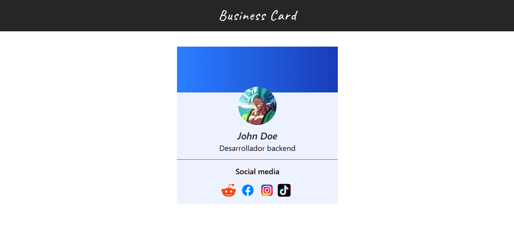

# Business card 
This is a mini project about a business card with social media. It was made with

- react 
- tailwindcss
- pnpm

# Prerequisites
Make sure you have the following installed:

- Node.js — https://nodejs.org/en/download
- pnpm: `npm install -g pnpm`

# How to use the project
- Clone the repository: `git clone https://github.com/williamgarcia2004/business-card-with-react-and-tailwindcss.git` (with `.` you'll clone the project in the current folder)
- Execute these commands: `pnpm install` and `pnpm run dev`
